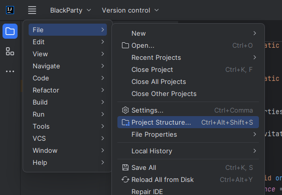
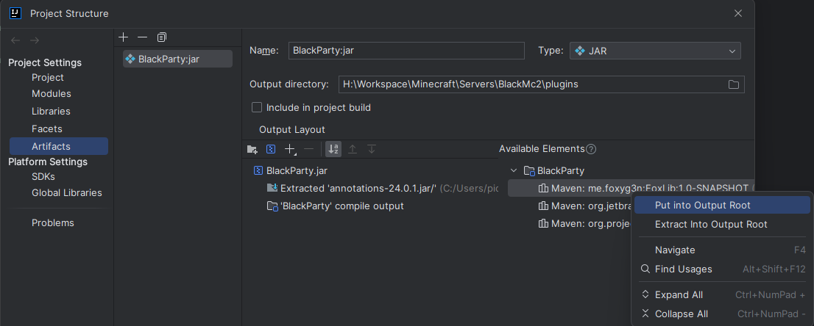

# FoxLib
Repository of FoxLib library for easier and better Spigot development. (Currently WIP)

## Importing as dependency in Maven
```xml
<repository>
    <id>foxlib-snapshots</id>
    <url>https://130.61.110.207/snapshots</url>
</repository>
```
```xml
<dependency>
  <groupId>me.foxyg3n</groupId>
  <artifactId>FoxLib</artifactId>
  <version>1.0-SNAPSHOT</version>
</dependency>
```
Make sure to shade the FoxLib into your build in maven, just toss this into your plugins section:

## Shade plugin
```xml
...
<build>
  <plugins>
    <plugin>
      <groupId>org.apache.maven.plugins</groupId>
      <artifactId>maven-shade-plugin</artifactId>
      <version>3.4.1</version>
      <executions>
        <execution>
          <phase>package</phase>
          <goals>
            <goal>shade</goal>
          </goals>
          <configuration>
            <filters>
              <filter>
                <artifact>me.foxyg3n:FoxLib</artifact>
                <includes>
                  <include>**</include>
                </includes>
              </filter>
            </filters>
          </configuration>
        </execution>
      </executions>
    </plugin>
  </plugins>
</build>
...
```

If you're using Intellij Artifacts you just have to extract FoxLib into your jar doing the following:



